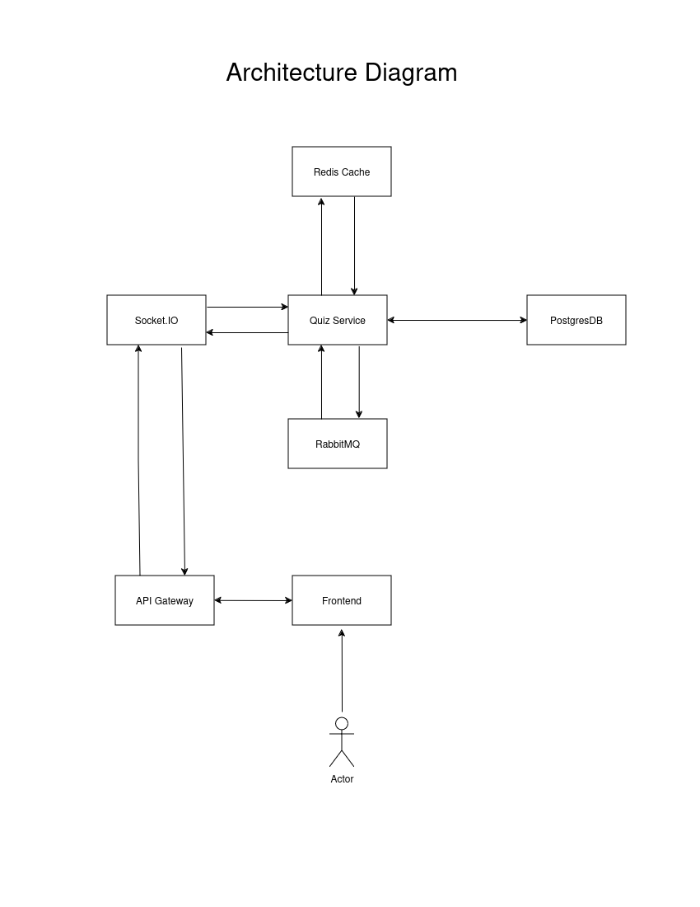
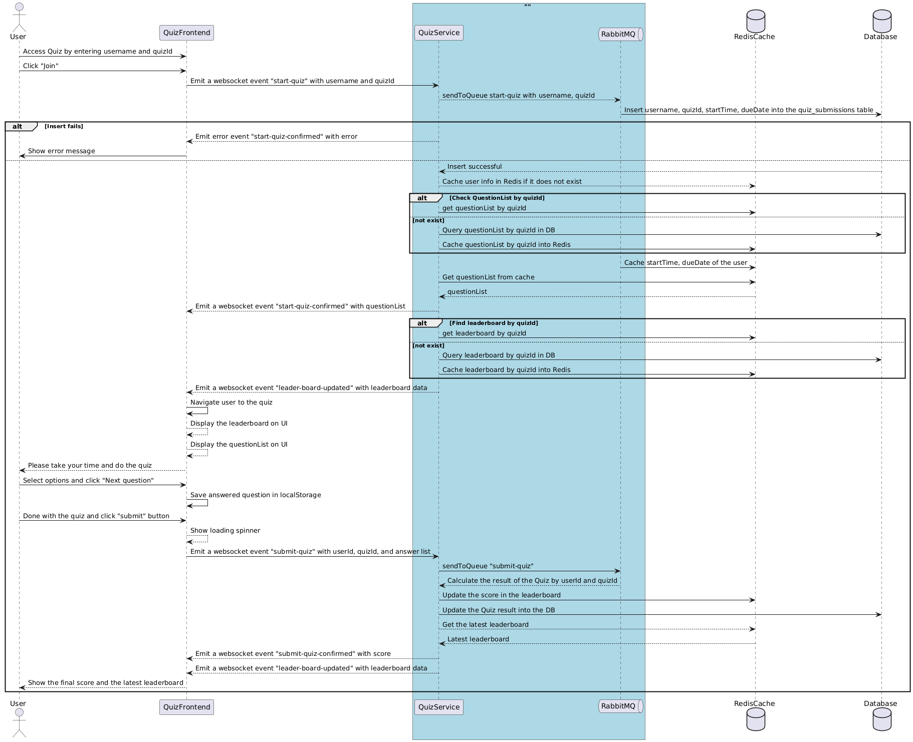
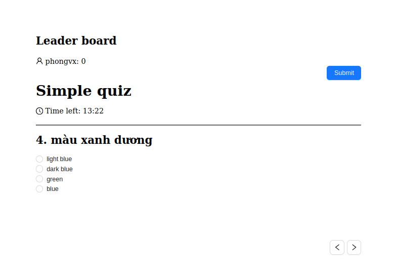
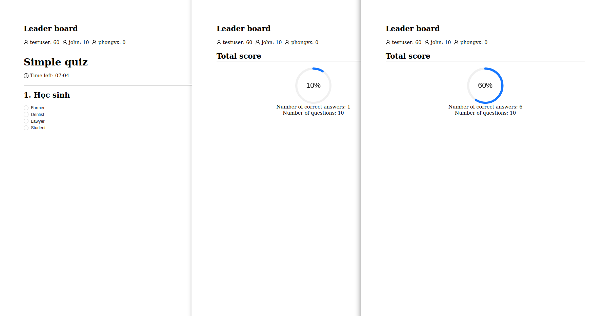

# Real-Time Vocabulary Quiz Coding Challenge
## System Design
### Architecture Diagram

### Component Description
1. Frontend: It's a frontend for user interaction, user can access the quiz by entering username and quizId, after submitting the quiz user can see the result and the leader board always up to date in real time whenever it has a user to submit their quiz.
2. API Gateway: It's the gateway for handling requests from client to the system, responsible for load balancing, rate limiting, caching, authentication, authorization or forward the request to the services. (future feature).
3. Socket.IO: Handle the web socket events from the client in real time.
4. RabbitMQ: Handle the message queue events in the system, It helped the system more reliable because of the durable feature of this message queue. It also can be scalable.
5. Quiz Service: This is the quiz service for handling the quiz business logic, it interacts with Database, Redis cache, Websocket, and RabbitMQ.
6. PostgresDB: The relational database to store the data of the system.
7. Redis Cache: It helped the system works faster by caching the frequency access data, saving the order of the leaderboard. Reduce the workload for the PostgresDB. (future feature).
### Data Flow

### Technologies and Tools:
1. Frontend: Using ReactJS with Socket. IO for interacting with the Quiz System. ReactJS is a well known library for building the front end really fast, SocketIO is built for web environment to handle the real time communication between browser and system.
2. API Gateway: It could be Nginx, Amazon API Gateway or Kong Gateway (future feature). For scaling we need an API Gateway for handling the request and forward it to the services as a Load Balancer.  
3. Quiz Service: Using Typescript, NodeJS and express, RabbitMQ, Socket.IO, Redis and Postgres database. 
   - Typescript: It makes the code easy to understand, maintainable and more consistent.
   - RabbitMQ: It's a message queue and It could be scalable by clustering, push up the reliability of the system by the durable features, It won't lose the data when the system has restarted in accident.
   - Postgres: It's a relational database, we can rely on indexing feature, sharding feature If we want to enhance the performance of the database and the Quiz data is the structured data, It's not the un-structured data so I won't choose the No-SQL database at this time.
   - Redis: It's the powerful caching ever, It's also support the pub/sub Mechanism and so many features for interacting with caching data, It also supports the clustering for scaling the future.

## Implementation
### Main page

User can enter username and quizId for joining the quiz.
### Quiz page

This is the result after user submit the quiz.

User can do the quiz and user can see the leader board in real time. After user submit the quiz user can see the result of the quiz and the leader board will be updated in real time for all users who are joining the quiz.
### Build For the Future:
1. Scalability: For scalable we can choose the technology that support clustering.
2. Performance: CDN and Caching Mechanism that will help the user access the system more faster. For the database we can apply Replica model for help reduce the workload in the database, we will have the Replica database for read-only and primary database for insert, Update and delete.
3. Reliability: We need to make sure that our system has no down time, prepared for backup and recovery and make sure it works well during peak hours. We can use AWS or Azure they are providing multiple options on cloud.
4. Maintainability: Using Typescript and clean architecture to make sure that the code will be easy to read and understand, writing the unit test to make sure the code change in the future won't impact the old features.  
5. Monitoring and Observability: We can monitor the performance of the application from frontend to backend using Appdynamics. Using Logstash, Elasticsearch and Kibana for logging, searching and visualizing log data in real time.

